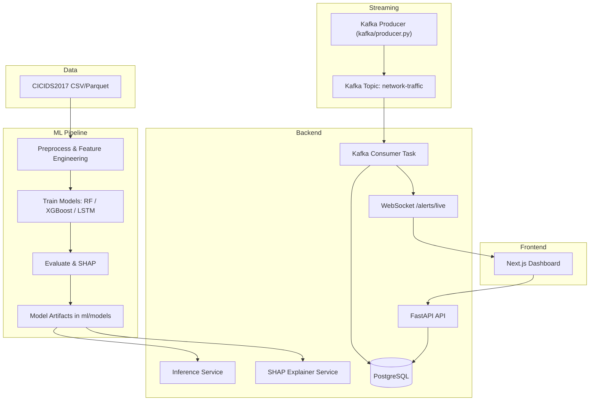
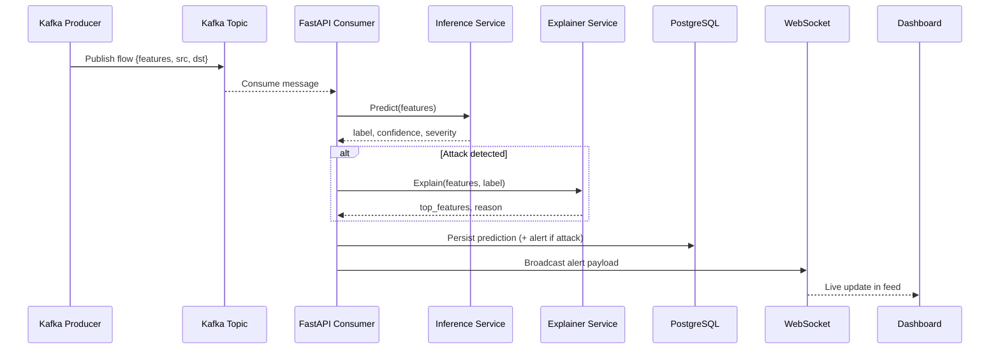
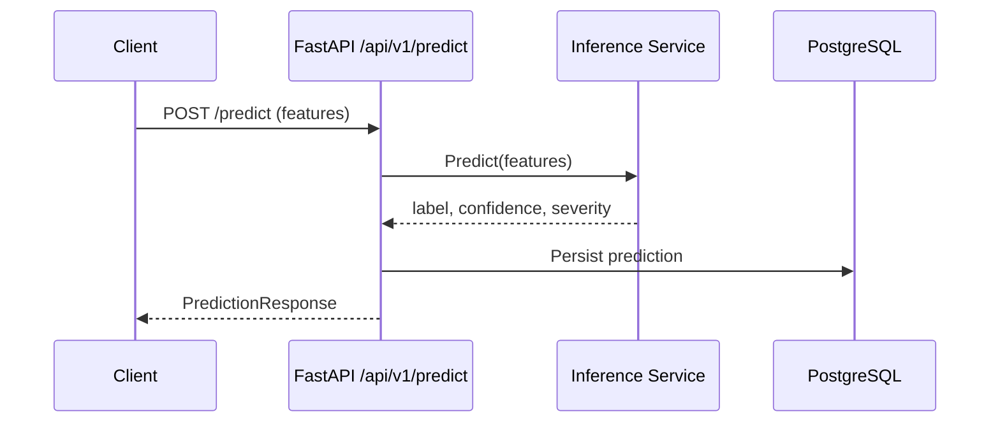

# XGuard-AI

Explainable AI-powered Network Intrusion Detection System (IDS) with real-time Kafka ingestion, FastAPI inference, SHAP explainability, PostgreSQL persistence, and a Next.js analyst dashboard.

This repository contains the full stack:
`ml/` for data prep and model training, `backend/` for inference and streaming, `kafka/` for traffic simulation, and `frontend/` for the live dashboard.

## Why This Exists
XGuard-AI focuses on three things that are hard to combine in traditional IDS tools:
1. Real-time detection on streaming data.
2. High-accuracy ML classification.
3. Actionable explanations via SHAP.

## Architecture



## End-to-End Flow

### Sequence: Real-Time Streaming Alerts


### Sequence: On-Demand Prediction API


## Repository Structure

```
.
├─ backend/              # FastAPI service, Kafka consumer, DB models
├─ frontend/             # Next.js analyst dashboard
├─ kafka/                # Traffic simulation producer
├─ ml/                   # Training pipeline + model artifacts
├─ docs/                 # Setup, API, model guide
├─ docker-compose.yml    # Kafka + Postgres + backend
└─ test_inference.py     # quick local inference script
```

Key entry points:
- `backend/app/main.py`: app lifecycle (load models, start Kafka consumer).
- `backend/app/services/inference.py`: XGBoost inference service.
- `backend/app/services/explainer.py`: SHAP explanations.
- `backend/app/services/kafka_consumer.py`: streaming pipeline.
- `frontend/app/page.tsx`: dashboard UI.
- `ml/scripts/run_pipeline.py`: training pipeline CLI.
- `kafka/producer.py`: Kafka traffic simulator.

## Tech Stack

- Backend: FastAPI, SQLAlchemy (async), aiokafka
- ML: scikit-learn, XGBoost, Keras, SHAP
- Storage: PostgreSQL
- Streaming: Kafka + Zookeeper
- Frontend: Next.js, Tailwind, shadcn/ui, recharts

## Quick Start (Local)

1. Configure root environment:
   - Copy `.env.example` to `.env`
   - Set `API_SECRET_KEY` (see docs/SETUP.md)
2. Start infra + backend:
   - `docker compose up -d`
3. Start frontend:
   - `cd frontend`
   - `npm install`
   - `npm run dev`
4. Simulate traffic:
   - `cd kafka`
   - `pip install -r requirements.txt`
   - `python producer.py --rate 10`

See `docs/SETUP.md` for a full end-to-end setup.

## Configuration

### Root `.env` (Backend + Docker)
Important variables:
- `DATABASE_URL`: async PostgreSQL connection string
- `KAFKA_BOOTSTRAP_SERVERS`: Kafka broker
- `API_SECRET_KEY`: required for all non-health API calls
- `CORS_ORIGINS`: allowed frontend origins
- `BEST_MODEL_TYPE`: serving model (default `xgboost`)
- `MODELS_DIR`: model artifact path (mounted at `/app/models`)

See `.env.example` for defaults.

### Frontend `.env.local`
- `NEXT_PUBLIC_API_URL`: `http://localhost:8000/api/v1`
- `NEXT_PUBLIC_WS_URL`: `ws://localhost:8000/api/v1`
- `NEXT_PUBLIC_API_TOKEN`: must match `API_SECRET_KEY`

For Vercel production, `NEXT_PUBLIC_API_TOKEN` must be set explicitly.
If it is blank, the dashboard can still receive unauthenticated WebSocket traffic,
but the authenticated REST calls used for alert history and SHAP explanations will fail.

For Vercel production, `NEXT_PUBLIC_API_TOKEN` must be set explicitly.
If it is blank, the dashboard can still receive unauthenticated WebSocket traffic,
but the authenticated REST calls used for alert history and SHAP explanations will fail.

## ML Pipeline

The ML pipeline lives in `ml/` and trains three models (RF, XGBoost, LSTM). XGBoost is served in production due to speed, size, and SHAP compatibility.

Common commands:
```
cd ml
python -m venv .venv
.venv\Scripts\activate
pip install -r requirements.txt
python scripts/run_pipeline.py --step all
```

Artifacts are saved under `ml/models/`:
```
ml/models/
  preprocessor/   scaler.pkl, label_encoder.pkl, feature_names.pkl
  xgboost/        model.json, metrics.json, shap_background.pkl, shap_summary.png
  random_forest/  model.pkl, metrics.json
  lstm/           model.keras, metrics.json
  evaluation_report.json
```

More details: `docs/MODEL_GUIDE.md`.

## Backend API

Base URL: `http://localhost:8000/api/v1`

Endpoints:
- `GET /health` (no auth)
- `POST /predict` (single prediction)
- `POST /predict/batch` (up to 1000 records)
- `GET /explain/{prediction_id}`
- `GET /alerts` (paginated history)
- `WS /alerts/live` (real-time stream)

Full details and schemas: `docs/API.md`.

## Frontend Dashboard

The dashboard consumes:
- REST history from `GET /alerts`
- Live WebSocket stream from `WS /alerts/live`
- SHAP explanations from `GET /explain/{id}`

Key UI modules:
- `frontend/components/dashboard/live-feed.tsx`
- `frontend/components/dashboard/attack-chart.tsx`
- `frontend/components/dashboard/stat-cards.tsx`
- `frontend/components/dashboard/shap-dialog.tsx`

## Testing

Backend tests use an in-memory SQLite database and a mocked inference service:
```
cd backend
pip install -r requirements.txt
pytest
```

## Operations Notes

- Backend starts a Kafka consumer on startup; if Kafka is down, the consumer will retry.
- The FastAPI lifespan loads models and SHAP background data on boot.
- WebSocket clients receive all traffic (benign and attacks) for live dashboards.

## Troubleshooting

- `model_loaded=false` on `/health`:
  - Ensure `ml/models` exists and is mounted to `/app/models` in Docker.
- `shap_loaded=false` on `/health`:
  - Check `shap_error` in the health response for the exact load failure.
  - Rebuild the deployment with the pinned backend ML dependency versions from `backend/requirements.txt`.
  - Verify `ml/models/xgboost/shap_background.pkl` is present in the deployment image.
- No live updates:
  - Confirm `kafka` is healthy and the producer is sending to `network-traffic`.
  - Check `NEXT_PUBLIC_WS_URL` and `NEXT_PUBLIC_API_TOKEN`.
- `403 Invalid or missing API key`:
  - Ensure frontend and API use the same `API_SECRET_KEY`.

## Security

All non-health endpoints require the `X-API-Key` header.
Rotate `API_SECRET_KEY` in production and scope `CORS_ORIGINS` to approved domains.

## Docs

- `docs/SETUP.md`: full local setup guide
- `docs/API.md`: API reference
- `docs/MODEL_GUIDE.md`: model selection and retraining
