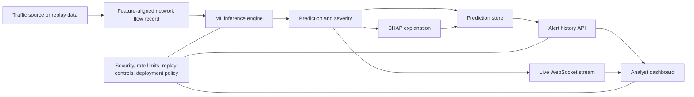

# XGuard-AI Project Technical Review and Deep Overview

## 1. Purpose and Scope

This document is a deep technical review of the XGuard-AI project based on direct inspection of the codebase, configuration, runtime design, trained-model artifacts, and project documentation. It is written as a project-level overview rather than a file-by-file commentary.

The report combines:

- implementation evidence from the repository itself,
- peer-reviewed research used to frame the project conceptually,
- official standards and reports used to assess operational fit and governance maturity.

In practical terms, XGuard-AI is not just a machine learning model. It is an end-to-end explainable network intrusion detection platform that brings together:

- offline data preparation and model training,
- low-latency online inference,
- local explainability through SHAP,
- stream ingestion through Kafka,
- persistence in PostgreSQL,
- analyst-facing monitoring through a modern web dashboard,
- replay tooling for demonstrations, validation, and controlled testing.

That combination makes the project stronger than a typical academic IDS prototype. It operates as a full detection workflow, not just a classification notebook.

## 2. Executive Assessment

XGuard-AI is best understood as an explainable, streaming, machine-learning-based network IDS with a strong "research to operations" orientation. The project is technically coherent because the major design choices align with the nature of the problem:

- It uses a tabular model family for tabular flow features.
- It keeps the production model simple enough for fast CPU inference.
- It adds SHAP to improve analyst trust and post-alert interpretability.
- It uses Kafka to simulate or ingest live traffic as a stream rather than treating traffic as static files.
- It persists predictions and alerts so the system supports both real-time and historical review.
- It provides an analyst dashboard instead of stopping at backend APIs.

The most important architectural judgment is the selection of XGBoost as the serving model. Based on the repository's own evaluation artifacts, XGBoost is the best fit among the implemented models:

| Model | Accuracy | Weighted F1 | Train Time (sec) | Inference ms/sample | Role in Project |
|---|---:|---:|---:|---:|---|
| Random Forest | 0.994491 | 0.996143 | 165.98 | 0.1974 | Strong baseline |
| XGBoost | 0.998568 | 0.998678 | 131.37 | 0.0594 | Production serving model |
| LSTM | 0.812089 | 0.752917 | 1227.15 | 3.6068 | Research comparison model |

This result matters. It shows the project is not using XGBoost because it is fashionable; it is using it because, in this implementation, it is materially more accurate and significantly faster than the alternatives while also fitting the explainability strategy.

## 3. Conceptual Framework

The project follows a five-layer conceptual framework for explainable cyber defense:

1. Observation layer: capture or replay network-flow records.
2. Intelligence layer: classify each flow as benign or a known attack class.
3. Explanation layer: generate local feature attributions for analyst review.
4. Operational layer: persist, visualize, and stream results to users.
5. Governance layer: secure access, constrain usage, and support controlled replay and evaluation.

In simplified form:

This is a strong conceptual design for a student project because it maps well onto known concerns in the literature:

- ML-based IDS must go beyond offline benchmark accuracy and address deployment realities, streaming data, and analyst usability [7].
- Explainability is especially valuable in cybersecurity because analysts face high alert volume and need interpretable reasons for automated decisions [4].
- AI systems in operational settings should be governed in terms of trustworthiness, risk, and lifecycle controls, not only prediction quality [5][6].

## 4. What Problem the Project Solves

The project targets a well-known weakness in many IDS demonstrations: they stop at model accuracy. In real use, an IDS is only valuable when it can:

- process traffic continuously,
- produce timely classifications,
- help a human understand why an alert fired,
- maintain historical records for review,
- support safe experimentation and replay,
- provide a usable interface for monitoring.

XGuard-AI addresses that broader problem. Conceptually, it sits between:

- a research benchmark pipeline, and
- an analyst-facing security operations tool.

It is therefore best categorized as an applied explainable IDS platform rather than a pure data science experiment.

## 5. Technology, Tools, and Frameworks Used

### 5.1 Frontend Stack

| Area | Technologies | Role |
|---|---|---|
| Framework | Next.js 16.1.7, React 19.2.4 | App shell, routing, client UI |
| Language | TypeScript 5.9.x | Type safety for dashboard logic |
| Styling | Tailwind CSS 4.2.x | Utility-first layout and theming |
| UI primitives | shadcn/ui, Radix UI | Accessible UI building blocks |
| Charts | Recharts 3.8.x | Traffic distribution and explanation visuals |
| Icons | lucide-react | Visual semantics for dashboard and landing page |
| Theme system | next-themes | Light and dark mode support |
| Utilities | date-fns, clsx, class-variance-authority, tailwind-merge | Formatting and UI composition |

Why this stack fits:

- Next.js gives a clean structure for a polished dashboard and landing page.
- React is suitable for stateful live-monitoring views.
- Tailwind plus shadcn/ui gives fast UI composition with acceptable design consistency.
- Recharts is appropriate for lightweight operational charts without introducing heavy visualization infrastructure.

### 5.2 Backend Stack

| Area | Technologies | Role |
|---|---|---|
| API framework | FastAPI | REST API, WebSocket endpoints, OpenAPI docs |
| ASGI server | Uvicorn | Runtime serving layer |
| Validation | Pydantic 2, pydantic-settings | Request schemas and environment-driven configuration |
| ORM / persistence | SQLAlchemy 2 async | Async data access and ORM mapping |
| Postgres driver | asyncpg | Async PostgreSQL connectivity |
| Migrations | Alembic | Schema migration support exists in project |
| Streaming client | aiokafka | Kafka consumer integration |
| Rate limiting | slowapi | Request-throttling layer |

Why this stack fits:

- FastAPI is a particularly good fit for ML-backed APIs because it combines async I/O, clear schema contracts, and strong documentation support.
- Async SQLAlchemy and asyncpg allow the backend to remain responsive while handling database-bound work.
- aiokafka is appropriate for background stream consumption without forcing a separate JVM service into the application layer.

### 5.3 Data Science and Machine Learning Stack

| Area | Technologies | Role |
|---|---|---|
| Data wrangling | pandas 2.2.3, numpy 1.26.4 | Cleaning, transforms, training inputs |
| Classical ML | scikit-learn 1.6.1 | preprocessing, encoding, metrics, Random Forest |
| Imbalance handling | imbalanced-learn 0.13.0 | RandomUnderSampler and SMOTE |
| Gradient boosting | XGBoost 2.1.3 | Production serving model |
| Deep learning | TensorFlow 2.19.0 / Keras | LSTM comparison model |
| Explainability | SHAP 0.46.0 | Global and local model explanations |
| Serialization | joblib | Scaler, encoders, feature lists, background data |
| Storage format | pyarrow 19.0.1 | Parquet support |
| Visualization | matplotlib, seaborn | Offline evaluation and SHAP plots |

Why this stack fits:

- The traffic data is tabular, so tree-based models are a natural first choice.
- XGBoost is a strong fit for multiclass flow classification with tight latency budgets [2].
- SHAP is one of the most defensible explanation methods for tree ensembles because it provides local feature contributions tied to a well-defined additive framework [3].

### 5.4 Infrastructure and Runtime Tooling

| Area | Technologies | Role |
|---|---|---|
| Containerization | Docker, Docker Compose | Reproducible local deployment |
| Message broker | Kafka | Stream ingestion and replay path |
| Coordination | Zookeeper | Local Kafka stack support in compose |
| Database | PostgreSQL 16 | Prediction and alert persistence |
| Deployment variant | Hugging Face Spaces runtime scripts | Cloud-friendly demo deployment path |
| Testing | pytest, pytest-asyncio, httpx | Backend route testing |
| Frontend quality tools | ESLint, Prettier, TypeScript | Static checks and code hygiene |
| Graph understanding | graphify | Architecture and community mapping |

Operationally, the project supports both:

- a local dockerized stack for development and demonstration, and
- a cloud-style deployment path where backend and frontend can be separated.

## 6. Detailed Review of Each Major Module

### 6.1 Data Acquisition and Preprocessing Module

This module is the foundation of the system's validity. It takes the CICIDS2017 dataset and transforms it into training-ready flow data.

Core responsibilities:

- load multi-file raw CSV traffic extracts,
- drop identifier-heavy columns such as IPs, timestamps, and flow IDs,
- replace infinities and remove nulls,
- collapse noisy raw attack labels into a smaller unified attack taxonomy,
- split data into train and test sets,
- rebalance the training distribution,
- scale numeric features,
- persist both transformed data and preprocessing artifacts.

The preprocessing design is stronger than a naive classroom pipeline for three reasons:

1. It explicitly handles class imbalance.
2. It preserves the fitted scaler, label encoder, and ordered feature names as production artifacts.
3. It prepares reproducible Parquet outputs that can be reused across training, SHAP analysis, and replay.

The balancing strategy is particularly notable. The project does not simply apply SMOTE blindly. It first under-samples very large classes, then over-samples minority classes. That is a pragmatic response to memory pressure and computational cost. It suggests the author was thinking operationally, not just statistically.

Conceptual interpretation:

- The module treats data engineering as part of model governance.
- It acknowledges that training quality depends on label normalization and class balance, not only on the classifier.

Important limitation:

- The dataset remains a controlled benchmark, not live enterprise traffic. As Sommer and Paxson warned, IDS research often performs better in closed-world conditions than in operational deployment [7]. So the module is strong for benchmarking and demonstration, but it should not be mistaken for proof of field performance.

### 6.2 Model Training and Comparative Evaluation Module

This module trains three model families:

- Random Forest,
- XGBoost,
- LSTM.

This is an excellent project decision because it creates a comparative story:

- Random Forest functions as a robust classical baseline.
- XGBoost functions as the practical serving model.
- LSTM functions as a research-oriented sequential comparator.

That three-model framing makes the repository more academically credible than a single-model implementation.

#### Why XGBoost is the right production choice here

The choice is well supported by both internal evidence and research literature:

- XGBoost is designed for scalable tree boosting and emphasizes computational efficiency, sparse-data handling, and resource-aware performance [2].
- Tree models pair naturally with SHAP's TreeExplainer, which is more suitable for real-time explanation than generic model-agnostic approaches [3].
- In this repository's own metrics, XGBoost is both the most accurate and the fastest.

This is a textbook example of selecting a production model using a multi-criteria decision rule:

- predictive performance,
- latency,
- deployability,
- explainability compatibility.

#### Interpretation of the LSTM result

The LSTM performs much worse than the tree models in this repository. That does not mean deep learning is inherently bad for IDS. It means this implementation's problem framing favors tabular single-flow classification more than sequential deep modeling.

Likely reasons:

- the serving use case is single-flow or short-batch scoring,
- the pipeline derives features that already summarize flows well,
- sequence windowing adds complexity without generating a proportional gain,
- local explainability is much easier for the tree-based solution.

This is one of the strongest design lessons in the whole project: the simplest model family that matches the data representation often wins in security analytics.

### 6.3 Explainability Module

Explainability is not cosmetic in this project. It is integrated into both the research layer and the runtime layer.

The module performs two related functions:

- global explanation: produces a SHAP feature-importance summary for the trained XGBoost model,
- local explanation: returns top contributing features for individual predictions.

This matters for two reasons:

1. It improves analyst usability.
2. It improves academic defensibility.

The local explanation path is especially valuable. Each explained prediction returns:

- the predicted label,
- top contributing features,
- direction of feature effect,
- a plain-language reason statement.

That is a strong design for an IDS dashboard. It translates raw model behavior into something a human reviewer can interpret quickly.

This aligns closely with the explainable AI literature in cybersecurity, which argues that explanations can help operators evaluate threats and reduce alert fatigue [4].

Critical review:

- The current explainability approach is good for transparency.
- It is not yet a full trustworthiness framework.

Recent literature makes an important distinction: explanation availability is not the same as explanation robustness. XAI systems themselves can be attacked, manipulated, or misunderstood [4]. So the project's SHAP integration is a major strength, but it should be treated as an analyst support layer, not a formal proof of model correctness.

### 6.4 Streaming, Replay, and Traffic Simulation Module

This module is one of the project's most distinctive strengths.

Instead of limiting the system to offline prediction, XGuard-AI includes:

- a Kafka producer that publishes replayed traffic,
- a Kafka consumer that scores incoming traffic,
- a replay manager that lets analysts start and stop controlled replay from the dashboard.

Conceptually, this is very important. It means the project supports:

- runtime demonstration,
- smoke testing,
- validation on held-out data,
- analyst training,
- workflow rehearsal.

The replay path is also technically thoughtful. The producer inverse-transforms scaled rows before publishing them so replay data resembles operational feature values rather than internal training coordinates. That is a subtle but meaningful design improvement.

Why Kafka is appropriate:

- It models traffic as a stream of events.
- It decouples production from consumption.
- It gives the system a more realistic operational feel than direct function calls.

For an IDS project, that is the correct abstraction. Intrusion detection is naturally event-driven.

Review conclusion:

- This module significantly improves the realism of the project.
- It turns the repository from a static ML app into a stream-aware security platform.

### 6.5 Backend Application and Service Layer

The backend is the orchestration core of the project.

Its responsibilities include:

- loading model and explainer artifacts at startup,
- preparing the database connection,
- running the Kafka consumer lifecycle,
- exposing inference and explanation APIs,
- serving alert history,
- pushing live events over WebSocket,
- managing replay control endpoints,
- enforcing API-key checks and rate limiting.

This is a clean service-oriented backend. It is not split into many microservices, but for the project scale that is a sensible decision. A single application process owns the control plane and the inference plane. That keeps deployment simpler and supports easier academic presentation.

From a software engineering perspective, the layering is good:

- route layer for transport concerns,
- schema layer for contracts,
- service layer for domain behavior,
- persistence layer for models and sessions,
- configuration/security layer for environment policies.

This is a clear sign of structure and maintainability.

### 6.6 Persistence and Data Model Module

The persistence layer stores two essential concepts:

- predictions,
- alerts.

Predictions represent all evaluated flows. Alerts represent attack-class detections that are important enough to surface in analyst workflows.

This distinction is architecturally sound because it separates:

- model activity from
- incident-facing operational outputs.

The data model also stores:

- raw feature payloads,
- SHAP explanation JSON,
- confidence,
- severity,
- source and destination IPs.

This makes the database more than a logging sink. It becomes a forensic support layer.

Strengths:

- JSON storage is flexible for feature vectors and explanation payloads.
- Async sessions support non-blocking API behavior.
- Optional-database fallback allows degraded operation if persistence is unavailable.

Limitations:

- The current schema is intentionally lightweight.
- It is optimized for functionality, not full relational governance.

For example, the design favors agility over strict modeling of relationships, constraints, and audit policy. That is acceptable for a project platform, but it would need tightening for a regulated production environment.

### 6.7 Frontend Analyst Dashboard Module

The frontend is an analyst-oriented monitoring interface rather than a generic admin panel.

Main functional areas:

- landing page that communicates product positioning,
- live dashboard with connection status,
- aggregate stat cards,
- traffic distribution chart,
- live packet or alert feed,
- SHAP explanation dialog,
- replay controls,
- theme support.

This is important because many student ML projects fail at the last mile: they produce predictions but no usable human interface. XGuard-AI avoids that problem.

The dashboard behavior is also thoughtful:

- it combines initial history fetch with WebSocket live updates,
- it keeps live feed usability manageable through pause-on-scroll behavior,
- it exposes SHAP drill-down directly from alert rows,
- it surfaces operational state such as replay readiness and stream connectivity.

This is a good analyst workflow design:

- see what is happening,
- inspect what matters,
- request explanation,
- control replay if needed.

In conceptual terms, the frontend converts the backend from an ML service into a cyber operations tool.

### 6.8 Security, Access Control, and Governance Module

The project includes several operational control mechanisms:

- API-key-based access control,
- token scope concepts,
- rate limiting,
- CORS configuration,
- health-check separation,
- replay enable/disable settings.

This shows strong intent. The project is trying to treat security services as governed systems, not only as technical demos.

That said, this is also where the review finds some of the most important maturity gaps:

- the intended public-versus-admin token model is stronger in documentation than in actual runtime behavior,
- the browser-facing design implies a looser security boundary than a production SOC tool would normally allow,
- WebSocket delivery is more open than the REST path.

These are not fatal design flaws for an academic project, but they are exactly the kinds of boundary conditions that should be highlighted in a serious review.

### 6.9 Deployment and Runtime Operations Module

The deployment story is broader than many course projects:

- local containerized stack with Kafka, Zookeeper, PostgreSQL, and backend,
- separate frontend runtime,
- cloud-oriented deployment path using Hugging Face Spaces,
- alternative documentation for Supabase and Upstash-based service substitution.

This reveals an important characteristic of the project: it is designed to be demonstrated, shared, and potentially deployed outside the original development machine.

The Hugging Face backend path is particularly interesting because it includes a script that starts a self-contained Kafka runtime in KRaft mode alongside the application. That is a clever demo-oriented compromise when a fully managed broker is not available.

Architectural judgment:

- For demo deployment, this is flexible and effective.
- For enterprise production, the broker, database, secrets, and observability stack would need externalization and hardening.

### 6.10 Testing and Verification Module

The test story is modest but meaningful.

What the repository already does well:

- backend routes are tested asynchronously,
- prediction behavior is isolated with a fake inference service,
- the test database is lightweight and disposable.

What is still missing:

- end-to-end stream tests,
- WebSocket contract tests,
- replay lifecycle tests,
- frontend component or integration tests,
- stronger migration and persistence verification,
- model artifact validation checks in CI.

This means the project currently demonstrates functional intent more than deep automated assurance.

That is normal for a capstone or applied research prototype, but it should be said clearly.

## 7. Backend Technology Review

Because the user specifically requested backend technology review, this section isolates the backend as its own engineering subsystem.

### 7.1 Architectural Style

The backend is a hybrid of:

- synchronous domain logic for CPU-bound model execution,
- asynchronous I/O for network, database, and streaming concerns,
- background-task orchestration for Kafka consumption.

This is a good fit for ML-backed APIs. CPU-heavy prediction is offloaded through a threadpool wrapper, while the application remains async at the transport and persistence boundaries.

### 7.2 Why FastAPI Fits This Project

FastAPI is a strong choice because it gives the project:

- typed request and response contracts,
- automatic OpenAPI documentation,
- async-friendly route definitions,
- easy dependency injection,
- clean integration with WebSockets and background startup/shutdown logic.

For an IDS platform that exposes prediction, explanation, history, and live updates, FastAPI offers a very good balance between productivity and architectural clarity.

### 7.3 Why SQLAlchemy Async Fits

SQLAlchemy async is appropriate here because the database workload is not the dominant computational burden. The expensive part is model scoring and SHAP computation, not SQL complexity. Async ORM sessions help the service remain responsive while performing database writes and reads around those expensive operations.

### 7.4 Why Kafka Fits the Backend

Kafka is one of the project's most appropriate backend technology choices because intrusion detection is event-native. Each traffic flow is an event. Kafka gives:

- stream semantics,
- replayability,
- decoupling between producer and consumer,
- a realistic event-processing mental model.

Even when used in a simplified local setup, it gives the project architectural credibility.

### 7.5 Why the Backend Is Not Yet Fully Production-Hardened

The backend is operationally solid for a project platform, but it is not fully mature in the sense expected of enterprise SOC tooling. The most important reasons are:

- security boundary inconsistencies,
- limited automated test depth,
- limited observability,
- schema-management looseness,
- a mostly single-service control plane.

That does not reduce the project's value. It simply defines its current maturity level correctly.

## 8. Internal Strengths of the Project

The strongest aspects of XGuard-AI are:

### 8.1 Strong alignment between data representation and model choice

The project uses tabular flow features and serves a high-performing tree-based model. This is methodologically coherent.

### 8.2 Explainability is integrated, not bolted on

The project treats explanation as part of the alert workflow. That is a major strength.

### 8.3 Replay closes the loop between offline evaluation and live demonstration

Replay is one of the best features in the repository because it supports teaching, validation, and operational simulation.

### 8.4 The system is full-stack, not isolated

It spans ML, backend engineering, streaming, persistence, UI, and deployment. That breadth is a strong sign of project completeness.

### 8.5 Graceful degradation exists

The backend can continue in reduced mode when persistence is unavailable, which is a mature operational choice for a project of this scale.

## 9. Key Limitations and Improvement Priorities

The project is strong, but a serious review should also identify where it can improve.

### 9.1 Security boundary design needs tightening

The repository intends to support both admin and public tokens, but the practical access-control model is not yet fully consistent. In its current form, the browser integration and live-update path are better suited to a demo or controlled environment than a hard production boundary.

Priority improvement:

- formalize token scopes,
- remove any dependence on browser-exposed privileged keys,
- secure WebSocket authorization explicitly.

### 9.2 Governance maturity is behind modeling maturity

The project is stronger in model engineering than in lifecycle governance. For higher-assurance deployment, it needs clearer migration discipline, secrets handling, auditability, and monitoring.

Priority improvement:

- use migration-first schema evolution,
- add structured audit and telemetry,
- centralize secret handling.

### 9.3 Dataset realism remains a closed-world constraint

CICIDS2017 is still a benchmark dataset. It is valuable, but it does not fully solve domain shift, modern traffic evolution, or adversarial adaptation [1][7].

Priority improvement:

- add secondary datasets,
- test cross-dataset generalization,
- introduce drift monitoring and recalibration strategy.

### 9.4 Explainability is present, but explanation assurance is not

The project explains predictions, which is excellent. But it does not yet test whether explanations remain stable, robust, and decision-useful under adversarial or shifted conditions.

Priority improvement:

- evaluate explanation stability,
- compare local explanations with analyst expectations,
- add explanation quality or consistency checks.

### 9.5 Automated verification is still shallow

The system has the beginnings of good backend testing, but its most distinctive features, streaming and analyst workflow, are exactly where test depth is still limited.

Priority improvement:

- add end-to-end replay tests,
- add WebSocket and dashboard integration tests,
- add CI checks for model artifact integrity and schema compatibility.

## 10. Overall Project Judgment

Overall, XGuard-AI is a well-conceived full-stack explainable IDS platform with a strong academic-practical balance.

What makes it impressive is not merely that it predicts attacks. What makes it technically meaningful is that it connects:

- benchmark data engineering,
- comparative model evaluation,
- real-time streaming,
- local explainability,
- persistence,
- analyst interaction,
- replay-based validation.

That is the architecture of a serious applied AI security project.

If judged as a student or capstone system, it is above average because it demonstrates system thinking across multiple engineering layers. If judged as an enterprise-ready IDS product, it still requires hardening in security boundaries, governance, testing depth, and operational assurance.

The core design choice is correct: use a fast tabular model, preserve explainability, expose results through a stream-aware service, and make the system reviewable by analysts. That is the project's central technical success.

## 11. Selected References

### External research and standards

1. Canadian Institute for Cybersecurity, University of New Brunswick. "CICIDS2017 Dataset." Highlights the dataset's heterogeneity, attack coverage, and extraction of more than 80 flow features. https://www.unb.ca/cic/datasets/ids-2017.html
2. Chen, T., and Guestrin, C. (2016). "XGBoost: A Scalable Tree Boosting System." Shows why XGBoost is efficient and scalable for large tabular learning problems. https://arxiv.org/pdf/1603.02754
3. Lundberg, S. M., and Lee, S.-I. (2017). "A Unified Approach to Interpreting Model Predictions." Foundational SHAP paper. https://papers.neurips.cc/paper/7062-a-unified-approach-to-interpreting-model-predictions
4. Charmet, F., Tanuwidjaja, H. C., Ayoubi, S., et al. (2022). "Explainable artificial intelligence for cybersecurity: a literature survey." Annals of Telecommunications, 77, 789-812. https://doi.org/10.1007/s12243-022-00926-7
5. Tabassi, E. (2023). "Artificial Intelligence Risk Management Framework (AI RMF 1.0)." National Institute of Standards and Technology. https://doi.org/10.6028/NIST.AI.100-1
6. Pascoe, C., Quinn, S., and Scarfone, K. (2024). "The NIST Cybersecurity Framework (CSF) 2.0." National Institute of Standards and Technology. https://doi.org/10.6028/NIST.CSWP.29
7. Sommer, R., and Paxson, V. (2010). "Outside the Closed World: On Using Machine Learning for Network Intrusion Detection." IEEE Symposium on Security and Privacy. https://doi.org/10.1109/SP.2010.25

### Internal empirical basis

This review also relies on the repository's own trained-artifact outputs, runtime behavior, and architecture implementation, including:

- comparative model metrics,
- backend service logic,
- traffic replay behavior,
- dashboard data flow,
- deployment configuration,
- test scaffolding,
- graph-based architecture summary.
