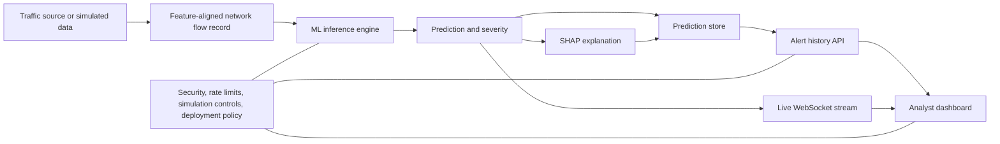
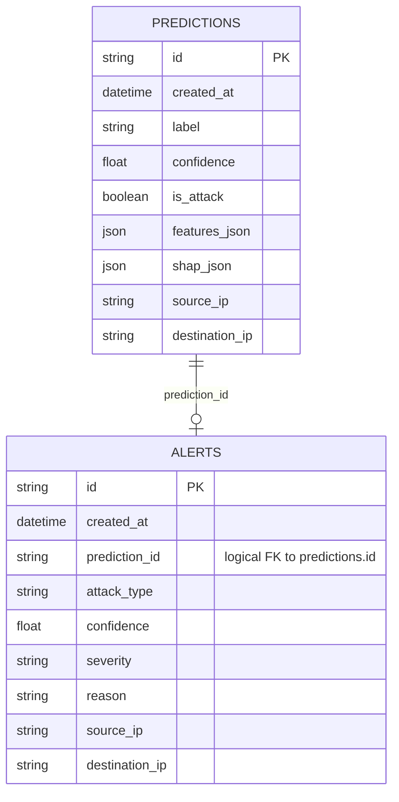

# XGuard-AI Project Technical Review and Deep Overview

## 1. Purpose and Scope

This document is a deep technical review of the XGuard-AI project based on direct inspection of the codebase, configuration, runtime design, trained-model artifacts, and project documentation. It is written as a project-level overview rather than a file-by-file commentary.

The report combines:

- implementation evidence from the repository itself,
- peer-reviewed research used to frame the project conceptually,
- official standards and reports used to assess operational fit and governance maturity.

In practical terms, XGuard-AI is not just a machine learning model. It is an end-to-end explainable network intrusion detection platform that brings together:

- offline data preparation and model training,
- low-latency online inference,
- local explainability through SHAP,
- stream ingestion through Kafka,
- persistence in PostgreSQL,
- analyst-facing monitoring through a modern web dashboard,
- custom CSV log simulation for demonstrations, validation, and controlled testing.

That combination makes the project stronger than a typical academic IDS prototype. It operates as a full detection workflow, not just a classification notebook.

## 2. Executive Assessment

XGuard-AI is best understood as an explainable, streaming, machine-learning-based network IDS with a strong "research to operations" orientation. The project is technically coherent because the major design choices align with the nature of the problem:

- It uses a tabular model family for tabular flow features.
- It keeps the production model simple enough for fast CPU inference.
- It adds SHAP to improve analyst trust and post-alert interpretability.
- It uses Kafka to simulate or ingest live traffic as a stream rather than treating traffic as static files.
- It persists predictions and alerts so the system supports both real-time and historical review.
- It provides an analyst dashboard instead of stopping at backend APIs.

The most important architectural judgment is the selection of XGBoost as the serving model. Based on the repository's own evaluation artifacts, XGBoost is the best fit among the implemented models:

| Model | Accuracy | Weighted F1 | Train Time (sec) | Inference ms/sample | Role in Project |
|---|---:|---:|---:|---:|---|
| Random Forest | 0.994491 | 0.996143 | 165.98 | 0.1974 | Strong baseline |
| XGBoost | 0.998568 | 0.998678 | 131.37 | 0.0594 | Production serving model |
| LSTM | 0.812089 | 0.752917 | 1227.15 | 3.6068 | Research comparison model |

This result matters. It shows the project is not using XGBoost because it is fashionable; it is using it because, in this implementation, it is materially more accurate and significantly faster than the alternatives while also fitting the explainability strategy.

## 3. Conceptual Framework

The project follows a five-layer conceptual framework for explainable cyber defense:

1. Observation layer: capture or simulate network-flow records.
2. Intelligence layer: classify each flow as benign or a known attack class.
3. Explanation layer: generate local feature attributions for analyst review.
4. Operational layer: persist, visualize, and stream results to users.
5. Governance layer: secure access, constrain usage, and support controlled simulation and evaluation.

In simplified form:


```mermaid
flowchart LR
    A[Traffic source or simulated data] --> B[Feature-aligned network flow record]
    B --> C[ML inference engine]
    C --> D[Prediction and severity]
    D --> E[SHAP explanation]
    D --> F[Prediction store]
    E --> F
    F --> G[Alert history API]
    D --> H[Live WebSocket stream]
    G --> I[Analyst dashboard]
    H --> I
    J[Security, rate limits, simulation controls, deployment policy] --- C
    J --- G
    J --- I
```

This is a strong conceptual design for a student project because it maps well onto known concerns in the literature:

- ML-based IDS must go beyond offline benchmark accuracy and address deployment realities, streaming data, and analyst usability [7].
- Explainability is especially valuable in cybersecurity because analysts face high alert volume and need interpretable reasons for automated decisions [4].
- AI systems in operational settings should be governed in terms of trustworthiness, risk, and lifecycle controls, not only prediction quality [5][6].

## 4. What Problem the Project Solves

The project targets a well-known weakness in many IDS demonstrations: they stop at model accuracy. In real use, an IDS is only valuable when it can:

- process traffic continuously,
- produce timely classifications,
- help a human understand why an alert fired,
- maintain historical records for review,
- support safe experimentation and stream simulation,
- provide a usable interface for monitoring.

XGuard-AI addresses that broader problem. Conceptually, it sits between:

- a research benchmark pipeline, and
- an analyst-facing security operations tool.

It is therefore best categorized as an applied explainable IDS platform rather than a pure data science experiment.

## 5. Technology, Tools, and Frameworks Used

### 5.1 Frontend Stack

| Area | Technologies | Role |
|---|---|---|
| Framework | Next.js 16.1.7, React 19.2.4 | App shell, routing, client UI |
| Language | TypeScript 5.9.x | Type safety for dashboard logic |
| Styling | Tailwind CSS 4.2.x | Utility-first layout and theming |
| UI primitives | shadcn/ui, Radix UI | Accessible UI building blocks |
| Charts | Recharts 3.8.x | Traffic distribution and explanation visuals |
| Icons | lucide-react | Visual semantics for dashboard and landing page |
| Theme system | next-themes | Light and dark mode support |
| Utilities | date-fns, clsx, class-variance-authority, tailwind-merge | Formatting and UI composition |

Why this stack fits:

- Next.js gives a clean structure for a polished dashboard and landing page.
- React is suitable for stateful live-monitoring views.
- Tailwind plus shadcn/ui gives fast UI composition with acceptable design consistency.
- Recharts is appropriate for lightweight operational charts without introducing heavy visualization infrastructure.

### 5.2 Backend Stack

| Area | Technologies | Role |
|---|---|---|
| API framework | FastAPI | REST API, WebSocket endpoints, OpenAPI docs |
| ASGI server | Uvicorn | Runtime serving layer |
| Validation | Pydantic 2, pydantic-settings | Request schemas and environment-driven configuration |
| ORM / persistence | SQLAlchemy 2 async | Async data access and ORM mapping |
| Postgres driver | asyncpg | Async PostgreSQL connectivity |
| Migrations | Alembic | Schema migration support exists in project |
| Streaming client | aiokafka | Kafka consumer integration |
| Rate limiting | slowapi | Request-throttling layer |

Why this stack fits:

- FastAPI is a particularly good fit for ML-backed APIs because it combines async I/O, clear schema contracts, and strong documentation support.
- Async SQLAlchemy and asyncpg allow the backend to remain responsive while handling database-bound work.
- aiokafka is appropriate for background stream consumption without forcing a separate JVM service into the application layer.

### 5.3 Data Science and Machine Learning Stack

| Area | Technologies | Role |
|---|---|---|
| Data wrangling | pandas 2.2.3, numpy 1.26.4 | Cleaning, transforms, training inputs |
| Classical ML | scikit-learn 1.6.1 | preprocessing, encoding, metrics, Random Forest |
| Imbalance handling | imbalanced-learn 0.13.0 | RandomUnderSampler and SMOTE |
| Gradient boosting | XGBoost 2.1.3 | Production serving model |
| Deep learning | TensorFlow 2.19.0 / Keras | LSTM comparison model |
| Explainability | SHAP 0.46.0 | Global and local model explanations |
| Serialization | joblib | Scaler, encoders, feature lists, background data |
| Storage format | pyarrow 19.0.1 | Parquet support |
| Visualization | matplotlib, seaborn | Offline evaluation and SHAP plots |

Why this stack fits:

- The traffic data is tabular, so tree-based models are a natural first choice.
- XGBoost is a strong fit for multiclass flow classification with tight latency budgets [2].
- SHAP is one of the most defensible explanation methods for tree ensembles because it provides local feature contributions tied to a well-defined additive framework [3].

### 5.4 Infrastructure and Runtime Tooling

| Area | Technologies | Role |
|---|---|---|
| Containerization | Docker, Docker Compose | Reproducible local deployment |
| Message broker | Kafka | Stream ingestion and simulation path |
| Coordination | Zookeeper | Local Kafka stack support in compose |
| Database | PostgreSQL 16 | Prediction and alert persistence |
| Deployment variant | Hugging Face Spaces runtime scripts | Cloud-friendly demo deployment path |
| Testing | pytest, pytest-asyncio, httpx | Backend route testing |
| Frontend quality tools | ESLint, Prettier, TypeScript | Static checks and code hygiene |
| Graph understanding | graphify | Architecture and community mapping |

Operationally, the project supports both:

- a local dockerized stack for development and demonstration, and
- a cloud-style deployment path where backend and frontend can be separated.

## 6. Detailed Review of Each Major Module

### 6.1 Data Acquisition and Preprocessing Module

This module is the foundation of the system's validity. It takes the CICIDS2017 dataset and transforms it into training-ready flow data.

Core responsibilities:

- load multi-file raw CSV traffic extracts,
- drop identifier-heavy columns such as IPs, timestamps, and flow IDs,
- replace infinities and remove nulls,
- collapse noisy raw attack labels into a smaller unified attack taxonomy,
- split data into train and test sets,
- rebalance the training distribution,
- scale numeric features,
- persist both transformed data and preprocessing artifacts.

The preprocessing design is stronger than a naive classroom pipeline for three reasons:

1. It explicitly handles class imbalance.
2. It preserves the fitted scaler, label encoder, and ordered feature names as production artifacts.
3. It prepares reproducible Parquet outputs that can be reused across training and SHAP analysis.

The balancing strategy is particularly notable. The project does not simply apply SMOTE blindly. It first under-samples very large classes, then over-samples minority classes. That is a pragmatic response to memory pressure and computational cost. It suggests the author was thinking operationally, not just statistically.

Conceptual interpretation:

- The module treats data engineering as part of model governance.
- It acknowledges that training quality depends on label normalization and class balance, not only on the classifier.

Important limitation:

- The dataset remains a controlled benchmark, not live enterprise traffic. As Sommer and Paxson warned, IDS research often performs better in closed-world conditions than in operational deployment [7]. So the module is strong for benchmarking and demonstration, but it should not be mistaken for proof of field performance.

### 6.2 Model Training and Comparative Evaluation Module

This module trains three model families:

- Random Forest,
- XGBoost,
- LSTM.

This is an excellent project decision because it creates a comparative story:

- Random Forest functions as a robust classical baseline.
- XGBoost functions as the practical serving model.
- LSTM functions as a research-oriented sequential comparator.

That three-model framing makes the repository more academically credible than a single-model implementation.

#### Why XGBoost is the right production choice here

The choice is well supported by both internal evidence and research literature:

- XGBoost is designed for scalable tree boosting and emphasizes computational efficiency, sparse-data handling, and resource-aware performance [2].
- Tree models pair naturally with SHAP's TreeExplainer, which is more suitable for real-time explanation than generic model-agnostic approaches [3].
- In this repository's own metrics, XGBoost is both the most accurate and the fastest.

This is a textbook example of selecting a production model using a multi-criteria decision rule:

- predictive performance,
- latency,
- deployability,
- explainability compatibility.

#### Interpretation of the LSTM result

The LSTM performs much worse than the tree models in this repository. That does not mean deep learning is inherently bad for IDS. It means this implementation's problem framing favors tabular single-flow classification more than sequential deep modeling.

Likely reasons:

- the serving use case is single-flow or short-batch scoring,
- the pipeline derives features that already summarize flows well,
- sequence windowing adds complexity without generating a proportional gain,
- local explainability is much easier for the tree-based solution.

This is one of the strongest design lessons in the whole project: the simplest model family that matches the data representation often wins in security analytics.

### 6.3 Explainability Module

Explainability is not cosmetic in this project. It is integrated into both the research layer and the runtime layer.

The module performs two related functions:

- global explanation: produces a SHAP feature-importance summary for the trained XGBoost model,
- local explanation: returns top contributing features for individual predictions.

This matters for two reasons:

1. It improves analyst usability.
2. It improves academic defensibility.

The local explanation path is especially valuable. Each explained prediction returns:

- the predicted label,
- top contributing features,
- direction of feature effect,
- a plain-language reason statement.

That is a strong design for an IDS dashboard. It translates raw model behavior into something a human reviewer can interpret quickly.

This aligns closely with the explainable AI literature in cybersecurity, which argues that explanations can help operators evaluate threats and reduce alert fatigue [4].

Critical review:

- The current explainability approach is good for transparency.
- It is not yet a full trustworthiness framework.

Recent literature makes an important distinction: explanation availability is not the same as explanation robustness. XAI systems themselves can be attacked, manipulated, or misunderstood [4]. So the project's SHAP integration is a major strength, but it should be treated as an analyst support layer, not a formal proof of model correctness.

### 6.4 Streaming and Traffic Simulation Module

This module is one of the project's most distinctive strengths.

Instead of limiting the system to offline prediction, XGuard-AI includes:

- a Kafka producer that handles stream publishing,
- a Kafka consumer that scores incoming traffic,
- a dynamic CSV upload module that allows users to supply custom log files, parsing and streaming them into Kafka with randomized delays and IPs to simulate live traffic flows realistically.

Conceptually, this is very important. It means the project supports:

- runtime demonstration,
- smoke testing,
- validation on held-out data,
- analyst training,
- workflow rehearsal.

The dynamic CSV Simulation allows an operator to upload their own datasets. The backend runs a background producer task that cleans the features, injects simulated source and destination IPs, and publishes the payloads to Kafka with randomized interval delays (0.0 to 2.0 seconds). This mimics natural, bursty network traffic rather than a static block insert, proving the architecture's capacity for asynchronous background stream generation. The process also includes a dedicated cancellation endpoint, preventing runaway background tasks.

Why Kafka is appropriate:

- It models traffic as a stream of events.
- It decouples production from consumption.
- It gives the system a more realistic operational feel than direct function calls.

For an IDS project, that is the correct abstraction. Intrusion detection is naturally event-driven.

Review conclusion:

- This module significantly improves the realism of the project.
- It turns the repository from a static ML app into a stream-aware security platform.

### 6.5 Backend Application and Service Layer

The backend is the orchestration core of the project.

Its responsibilities include:

- loading model and explainer artifacts at startup,
- preparing the database connection,
- running the Kafka consumer lifecycle,
- exposing inference and explanation APIs,
- serving alert history,
- pushing live events over WebSocket,
- enforcing API-key checks and rate limiting.

This is a clean service-oriented backend. It is not split into many microservices, but for the project scale that is a sensible decision. A single application process owns the control plane and the inference plane. That keeps deployment simpler and supports easier academic presentation.

From a software engineering perspective, the layering is good:

- route layer for transport concerns,
- schema layer for contracts,
- service layer for domain behavior,
- persistence layer for models and sessions,
- configuration/security layer for environment policies.

This is a clear sign of structure and maintainability.

### 6.6 Persistence and Data Model Module

The persistence layer stores two essential concepts:

- predictions,
- alerts.

Predictions represent all evaluated flows. Alerts represent attack-class detections that are important enough to surface in analyst workflows.

This distinction is architecturally sound because it separates:

- model activity from
- incident-facing operational outputs.

The data model also stores:

- raw feature payloads,
- SHAP explanation JSON,
- confidence,
- severity,
- source and destination IPs.

This makes the database more than a logging sink. It becomes a forensic support layer.

#### 6.6.1 Backend Schemas, Types, and ER-Diagram Mapping

The backend uses two schema layers:

- SQLAlchemy ORM models define the persisted database tables.
- Pydantic models define REST request and response contracts.

For ER diagrams, the main persisted entities are `predictions` and `alerts`. A prediction is created for every scored network flow. An alert is created only when the prediction is an attack. In the current implementation, `alerts.prediction_id` is indexed and logically references `predictions.id`, but it is not declared as an explicit SQL foreign key in the ORM model. This is useful to note in diagrams: the relationship exists at the application level and should be shown as a logical one-to-zero-or-one relationship.


```mermaid
erDiagram
    PREDICTIONS ||--o| ALERTS : "prediction_id"

    PREDICTIONS {
        string id PK
        datetime created_at
        string label
        float confidence
        boolean is_attack
        json features_json
        json shap_json
        string source_ip
        string destination_ip
    }

    ALERTS {
        string id PK
        datetime created_at
        string prediction_id "logical FK to predictions.id"
        string attack_type
        float confidence
        string severity
        string reason
        string source_ip
        string destination_ip
    }
```

Database table details:

| Table | Backend Model | Column | SQLAlchemy / DB Type | Python Type | Constraints / Indexes | Purpose |
|---|---|---|---|---|---|---|
| `predictions` | `Prediction` | `id` | `String(36)` | `str` | Primary key, UUID string default | Unique identifier for each scored flow |
| `predictions` | `Prediction` | `created_at` | `DateTime(timezone=True)` | `datetime` | UTC timestamp default | Time when prediction was created |
| `predictions` | `Prediction` | `label` | `String(64)` | `str` | Indexed | Predicted class such as `Benign`, `DDoS`, `PortScan` |
| `predictions` | `Prediction` | `confidence` | `Float` | `float` | Required | Model probability for selected class |
| `predictions` | `Prediction` | `is_attack` | inferred Boolean column | `bool` | Default `False` | Separates benign predictions from attack detections |
| `predictions` | `Prediction` | `features_json` | `JSON` | `dict` | Nullable | Raw feature vector used for inference |
| `predictions` | `Prediction` | `shap_json` | `JSON` | `dict` | Nullable | Cached SHAP explanation payload |
| `predictions` | `Prediction` | `source_ip` | `String(64)` | `str \| None` | Nullable | Simulated or supplied source IP |
| `predictions` | `Prediction` | `destination_ip` | `String(64)` | `str \| None` | Nullable | Simulated or supplied destination IP |
| `alerts` | `Alert` | `id` | `String(36)` | `str` | Primary key, UUID string default | Unique alert identifier |
| `alerts` | `Alert` | `created_at` | `DateTime(timezone=True)` | `datetime` | Indexed, UTC timestamp default | Time when alert was created |
| `alerts` | `Alert` | `prediction_id` | `String(36)` | `str` | Indexed, logical relation to `predictions.id` | Connects alert to its source prediction |
| `alerts` | `Alert` | `attack_type` | `String(64)` | `str` | Indexed | Attack class shown in dashboard and filters |
| `alerts` | `Alert` | `confidence` | `Float` | `float` | Required | Confidence copied from prediction result |
| `alerts` | `Alert` | `severity` | `String(16)` | `str` | Values generated as `LOW`, `MEDIUM`, `HIGH`, `CRITICAL` | Analyst-facing priority level |
| `alerts` | `Alert` | `reason` | `String(2048)` | `str \| None` | Nullable | Plain-language SHAP explanation summary |
| `alerts` | `Alert` | `source_ip` | `String(64)` | `str \| None` | Nullable | Source IP copied from event payload |
| `alerts` | `Alert` | `destination_ip` | `String(64)` | `str \| None` | Nullable | Destination IP copied from event payload |

Pydantic request and response schemas used by the backend:

| Schema | File / Route | Field | Type | Validation / Default | Used By |
|---|---|---|---|---|---|
| `PredictRequest` | `backend/app/schemas/prediction.py` | `features` | `dict[str, float]` | Required | `POST /api/v1/predict`, batch records, Kafka-style payload shape |
| `PredictRequest` | `backend/app/schemas/prediction.py` | `source_ip` | `str \| None` | Default `None` | Optional traffic metadata |
| `PredictRequest` | `backend/app/schemas/prediction.py` | `destination_ip` | `str \| None` | Default `None` | Optional traffic metadata |
| `BatchPredictRequest` | `backend/app/schemas/prediction.py` | `records` | `list[PredictRequest]` | Required, maximum 1000 | `POST /api/v1/predict/batch` |
| `PredictionResponse` | `backend/app/schemas/prediction.py` | `id` | `str` | Required | Single prediction API response |
| `PredictionResponse` | `backend/app/schemas/prediction.py` | `label` | `str` | Required | Predicted class returned to clients |
| `PredictionResponse` | `backend/app/schemas/prediction.py` | `confidence` | `float` | Required | Prediction confidence |
| `PredictionResponse` | `backend/app/schemas/prediction.py` | `is_attack` | `bool` | Required | Client-side benign/attack split |
| `PredictionResponse` | `backend/app/schemas/prediction.py` | `created_at` | `datetime` | Required | API timestamp |
| `BatchPredictionResponse` | `backend/app/schemas/prediction.py` | `results` | `list[PredictionResponse]` | Required | Batch prediction result list |
| `BatchPredictionResponse` | `backend/app/schemas/prediction.py` | `total` | `int` | Required | Number of returned predictions |
| `AlertResponse` | `backend/app/schemas/alert.py` | `id` | `str` | Required | Alert list and live dashboard payloads |
| `AlertResponse` | `backend/app/schemas/alert.py` | `created_at` | `datetime` | Required | Alert timestamp |
| `AlertResponse` | `backend/app/schemas/alert.py` | `prediction_id` | `str` | Required | Links alert to prediction/explanation lookup |
| `AlertResponse` | `backend/app/schemas/alert.py` | `attack_type` | `str` | Required | Dashboard attack category |
| `AlertResponse` | `backend/app/schemas/alert.py` | `confidence` | `float` | Required | Alert confidence score |
| `AlertResponse` | `backend/app/schemas/alert.py` | `severity` | `str` | Required | Priority badge in dashboard |
| `AlertResponse` | `backend/app/schemas/alert.py` | `reason` | `str \| None` | Default `None` | Human-readable explanation summary |
| `AlertsListResponse` | `backend/app/schemas/alert.py` | `alerts` | `list[AlertResponse]` | Required | `GET /api/v1/alerts` |
| `AlertsListResponse` | `backend/app/schemas/alert.py` | `total` | `int` | Required | Number of matching alerts |
| `AlertsListResponse` | `backend/app/schemas/alert.py` | `total_predictions` | `int` | Default `0` | Dashboard aggregate statistic |
| `AlertsListResponse` | `backend/app/schemas/alert.py` | `page` | `int` | Required | Pagination state |
| `AlertsListResponse` | `backend/app/schemas/alert.py` | `page_size` | `int` | Required | Pagination size |
| `ExplainResponse` | `backend/app/api/v1/routes/explain.py` | `prediction_id` | `str` | Required | `GET /api/v1/explain/{prediction_id}` |
| `ExplainResponse` | `backend/app/api/v1/routes/explain.py` | `label` | `str` | Required | Label being explained |
| `ExplainResponse` | `backend/app/api/v1/routes/explain.py` | `reason` | `str` | Required | SHAP-generated plain-language reason |
| `ExplainResponse` | `backend/app/api/v1/routes/explain.py` | `top_features` | `list[dict]` | Required | Feature attribution rows, usually `{feature, shap_value, direction}` |
| `HealthResponse` | `backend/app/api/v1/routes/health.py` | `status` | `str` | Required | `GET /api/v1/health` |
| `HealthResponse` | `backend/app/api/v1/routes/health.py` | `model_loaded` | `bool` | Required | Model readiness flag |
| `HealthResponse` | `backend/app/api/v1/routes/health.py` | `shap_loaded` | `bool` | Required | SHAP readiness flag |
| `HealthResponse` | `backend/app/api/v1/routes/health.py` | `shap_error` | `str \| None` | Default `None` | Explainer load error if present |
| `HealthResponse` | `backend/app/api/v1/routes/health.py` | `model_type` | `str` | Required | Active model family, normally `xgboost` |
| `HealthResponse` | `backend/app/api/v1/routes/health.py` | `environment` | `str` | Required | Runtime environment name |
| `ReplayStartRequest` | `backend/app/api/v1/routes/replay.py` | `rate` | `float` | Default `10.0`, `0 <= rate <= 500` | `POST /api/v1/replay/start` |
| `ReplayStartRequest` | `backend/app/api/v1/routes/replay.py` | `limit` | `int` | Default `500`, `0 <= limit <= 20000` | Replay volume control |
| `ReplayStartRequest` | `backend/app/api/v1/routes/replay.py` | `attack_only` | `bool` | Default `False` | Filters replay source |
| `ReplayStatusResponse` | `backend/app/api/v1/routes/replay.py` | `running`, `enabled`, `available`, `attack_only` | `bool` | Required | Replay state flags |
| `ReplayStatusResponse` | `backend/app/api/v1/routes/replay.py` | `rate` | `float` | Required | Current replay rate |
| `ReplayStatusResponse` | `backend/app/api/v1/routes/replay.py` | `limit` | `int` | Required | Current replay limit |
| `ReplayStatusResponse` | `backend/app/api/v1/routes/replay.py` | `started_at`, `finished_at`, `last_error` | `str \| None` | Default `None` | Replay lifecycle metadata |
| `ReplayStatusResponse` | `backend/app/api/v1/routes/replay.py` | `message`, `environment` | `str` | Required | Human-readable status and runtime environment |

Operational schema flow:

| Flow | Input Schema | Processing Layer | Persisted Table(s) | Output Schema / Event |
|---|---|---|---|---|
| Single prediction | `PredictRequest` | `InferenceService.predict()` | `predictions` when DB is available | `PredictionResponse` |
| Batch prediction | `BatchPredictRequest` | Repeated single prediction calls | `predictions` when DB is available | `BatchPredictionResponse` |
| Kafka traffic event | `{features, source_ip, destination_ip}` dictionary payload | `process_traffic_message()` | Always attempts `predictions`; creates `alerts` only for attacks | WebSocket alert JSON payload |
| Alert history | Query params: `page`, `page_size`, optional `attack_type` | SQLAlchemy alert query | Reads `alerts` and counts `predictions` | `AlertsListResponse` |
| Explanation lookup | Path parameter `prediction_id` | Cached `shap_json` or on-demand SHAP calculation | Reads and may update `predictions.shap_json` | `ExplainResponse` |
| Replay control | `ReplayStartRequest` | `traffic_replay_manager` | No direct table writes; Kafka consumer later writes detections | `ReplayStatusResponse` |

Strengths:

- JSON storage is flexible for feature vectors and explanation payloads.
- Async sessions support non-blocking API behavior.
- Optional-database fallback allows degraded operation if persistence is unavailable.

Limitations:

- The current schema is intentionally lightweight.
- It is optimized for functionality, not full relational governance.

For example, the design favors agility over strict modeling of relationships, constraints, and audit policy. That is acceptable for a project platform, but it would need tightening for a regulated production environment.

### 6.7 Frontend Analyst Dashboard Module

The frontend is an analyst-oriented monitoring interface rather than a generic admin panel.

Main functional areas:

- landing page that communicates product positioning,
- live dashboard with connection status,
- aggregate stat cards,
- traffic distribution chart,
- live packet or alert feed,
- SHAP explanation dialog,
- custom CSV log upload interface for simulation,
- theme support.

This is important because many student ML projects fail at the last mile: they produce predictions but no usable human interface. XGuard-AI avoids that problem.

The dashboard behavior is also thoughtful:

- it combines initial history fetch with WebSocket live updates,
- it keeps live feed usability manageable through pause-on-scroll behavior,
- it exposes SHAP drill-down directly from alert rows,
- it surfaces operational state such as stream connectivity.

This is a good analyst workflow design:

- see what is happening,
- inspect what matters,
- request explanation,
- simulate traffic if needed.

In conceptual terms, the frontend converts the backend from an ML service into a cyber operations tool.

### 6.8 Security, Access Control, and Governance Module

The project includes several operational control mechanisms:

- API-key-based access control,
- token scope concepts,
- rate limiting,
- CORS configuration,
- health-check separation.

This shows strong intent. The project is trying to treat security services as governed systems, not only as technical demos.

That said, this is also where the review finds some of the most important maturity gaps:

- the intended public-versus-admin token model is stronger in documentation than in actual runtime behavior,
- the browser-facing design implies a looser security boundary than a production SOC tool would normally allow,
- WebSocket delivery is more open than the REST path.

These are not fatal design flaws for an academic project, but they are exactly the kinds of boundary conditions that should be highlighted in a serious review.

### 6.9 Deployment and Runtime Operations Module

The deployment story is broader than many course projects:

- local containerized stack with Kafka, Zookeeper, PostgreSQL, and backend,
- separate frontend runtime,
- cloud-oriented deployment path using Hugging Face Spaces,
- alternative documentation for Supabase and Upstash-based service substitution.

This reveals an important characteristic of the project: it is designed to be demonstrated, shared, and potentially deployed outside the original development machine.

The Hugging Face backend path is particularly interesting because it includes a script that starts a self-contained Kafka runtime in KRaft mode alongside the application. That is a clever demo-oriented compromise when a fully managed broker is not available.

Architectural judgment:

- For demo deployment, this is flexible and effective.
- For enterprise production, the broker, database, secrets, and observability stack would need externalization and hardening.

### 6.10 Testing and Verification Module

The test story is modest but meaningful.

What the repository already does well:

- backend routes are tested asynchronously,
- prediction behavior is isolated with a fake inference service,
- the test database is lightweight and disposable.

What is still missing:

- end-to-end stream tests,
- WebSocket contract tests,
- stream simulation lifecycle tests,
- frontend component or integration tests,
- stronger migration and persistence verification,
- model artifact validation checks in CI.

This means the project currently demonstrates functional intent more than deep automated assurance.

That is normal for a capstone or applied research prototype, but it should be said clearly.

## 7. Backend Technology Review

Because the user specifically requested backend technology review, this section isolates the backend as its own engineering subsystem.

### 7.1 Architectural Style

The backend is a hybrid of:

- synchronous domain logic for CPU-bound model execution,
- asynchronous I/O for network, database, and streaming concerns,
- background-task orchestration for Kafka consumption.

This is a good fit for ML-backed APIs. CPU-heavy prediction is offloaded through a threadpool wrapper, while the application remains async at the transport and persistence boundaries.

### 7.2 Why FastAPI Fits This Project

FastAPI is a strong choice because it gives the project:

- typed request and response contracts,
- automatic OpenAPI documentation,
- async-friendly route definitions,
- easy dependency injection,
- clean integration with WebSockets and background startup/shutdown logic.

For an IDS platform that exposes prediction, explanation, history, and live updates, FastAPI offers a very good balance between productivity and architectural clarity.

### 7.3 Why SQLAlchemy Async Fits

SQLAlchemy async is appropriate here because the database workload is not the dominant computational burden. The expensive part is model scoring and SHAP computation, not SQL complexity. Async ORM sessions help the service remain responsive while performing database writes and reads around those expensive operations.

### 7.4 Why Kafka Fits the Backend

Kafka is one of the project's most appropriate backend technology choices because intrusion detection is event-native. Each traffic flow is an event. Kafka gives:

- stream semantics,
- event decoupling between producer and consumer,
- a realistic event-processing mental model.

Even when used in a simplified local setup, it gives the project architectural credibility.

### 7.5 Why the Backend Is Not Yet Fully Production-Hardened

The backend is operationally solid for a project platform, but it is not fully mature in the sense expected of enterprise SOC tooling. The most important reasons are:

- security boundary inconsistencies,
- limited automated test depth,
- limited observability,
- schema-management looseness,
- a mostly single-service control plane.

That does not reduce the project's value. It simply defines its current maturity level correctly.

## 8. Internal Strengths of the Project

The strongest aspects of XGuard-AI are:

### 8.1 Strong alignment between data representation and model choice

The project uses tabular flow features and serves a high-performing tree-based model. This is methodologically coherent.

### 8.2 Explainability is integrated, not bolted on

The project treats explanation as part of the alert workflow. That is a major strength.

### 8.3 CSV Simulation closes the loop between offline evaluation and live demonstration

The dynamic CSV upload simulation is one of the best features in the repository because it supports teaching, validation, and operational simulation. Analysts are not restricted to predefined data; they can supply their own logs and watch the system score them in real time as a realistic stream.

### 8.4 The system is full-stack, not isolated

It spans ML, backend engineering, streaming, persistence, UI, and deployment. That breadth is a strong sign of project completeness.

### 8.5 Graceful degradation exists

The backend can continue in reduced mode when persistence is unavailable, which is a mature operational choice for a project of this scale.

## 9. Key Limitations and Improvement Priorities

The project is strong, but a serious review should also identify where it can improve.

### 9.1 Security boundary design needs tightening

The repository intends to support both admin and public tokens, but the practical access-control model is not yet fully consistent. In its current form, the browser integration and live-update path are better suited to a demo or controlled environment than a hard production boundary.

Priority improvement:

- formalize token scopes,
- remove any dependence on browser-exposed privileged keys,
- secure WebSocket authorization explicitly.

### 9.2 Governance maturity is behind modeling maturity

The project is stronger in model engineering than in lifecycle governance. For higher-assurance deployment, it needs clearer migration discipline, secrets handling, auditability, and monitoring.

Priority improvement:

- use migration-first schema evolution,
- add structured audit and telemetry,
- centralize secret handling.

### 9.3 Dataset realism remains a closed-world constraint

CICIDS2017 is still a benchmark dataset. It is valuable, but it does not fully solve domain shift, modern traffic evolution, or adversarial adaptation [1][7].

Priority improvement:

- add secondary datasets,
- test cross-dataset generalization,
- introduce drift monitoring and recalibration strategy.

### 9.4 Explainability is present, but explanation assurance is not

The project explains predictions, which is excellent. But it does not yet test whether explanations remain stable, robust, and decision-useful under adversarial or shifted conditions.

Priority improvement:

- evaluate explanation stability,
- compare local explanations with analyst expectations,
- add explanation quality or consistency checks.

### 9.5 Automated verification is still shallow

The system has the beginnings of good backend testing, but its most distinctive features, streaming and analyst workflow, are exactly where test depth is still limited.

Priority improvement:

- add end-to-end simulation tests,
- add WebSocket and dashboard integration tests,
- add CI checks for model artifact integrity and schema compatibility.

## 10. Overall Project Judgment

Overall, XGuard-AI is a well-conceived full-stack explainable IDS platform with a strong academic-practical balance.

What makes it impressive is not merely that it predicts attacks. What makes it technically meaningful is that it connects:

- benchmark data engineering,
- comparative model evaluation,
- real-time streaming,
- local explainability,
- persistence,
- analyst interaction,
- simulation-based validation.

That is the architecture of a serious applied AI security project.

If judged as a student or capstone system, it is above average because it demonstrates system thinking across multiple engineering layers. If judged as an enterprise-ready IDS product, it still requires hardening in security boundaries, governance, testing depth, and operational assurance.

The core design choice is correct: use a fast tabular model, preserve explainability, expose results through a stream-aware service, and make the system reviewable by analysts. That is the project's central technical success.

## 11. Selected References

### External research and standards

1. Canadian Institute for Cybersecurity, University of New Brunswick. "CICIDS2017 Dataset." Highlights the dataset's heterogeneity, attack coverage, and extraction of more than 80 flow features. https://www.unb.ca/cic/datasets/ids-2017.html
2. Chen, T., and Guestrin, C. (2016). "XGBoost: A Scalable Tree Boosting System." Shows why XGBoost is efficient and scalable for large tabular learning problems. https://arxiv.org/pdf/1603.02754
3. Lundberg, S. M., and Lee, S.-I. (2017). "A Unified Approach to Interpreting Model Predictions." Foundational SHAP paper. https://papers.neurips.cc/paper/7062-a-unified-approach-to-interpreting-model-predictions
4. Charmet, F., Tanuwidjaja, H. C., Ayoubi, S., et al. (2022). "Explainable artificial intelligence for cybersecurity: a literature survey." Annals of Telecommunications, 77, 789-812. https://doi.org/10.1007/s12243-022-00926-7
5. Tabassi, E. (2023). "Artificial Intelligence Risk Management Framework (AI RMF 1.0)." National Institute of Standards and Technology. https://doi.org/10.6028/NIST.AI.100-1
6. Pascoe, C., Quinn, S., and Scarfone, K. (2024). "The NIST Cybersecurity Framework (CSF) 2.0." National Institute of Standards and Technology. https://doi.org/10.6028/NIST.CSWP.29
7. Sommer, R., and Paxson, V. (2010). "Outside the Closed World: On Using Machine Learning for Network Intrusion Detection." IEEE Symposium on Security and Privacy. https://doi.org/10.1109/SP.2010.25

### Internal empirical basis

This review also relies on the repository's own trained-artifact outputs, runtime behavior, and architecture implementation, including:

- comparative model metrics,
- backend service logic,
- traffic simulation behavior,
- dashboard data flow,
- deployment configuration,
- test scaffolding,
- graph-based architecture summary.
# Chapter 6 Actual Project Code Listings

Use these as replacements for the illustrative snippets in Chapter 6. Each block is copied from the current project codebase and labelled with its source file.

> Note: the project maps CICIDS2017 raw labels into 9 unified categories, not 6. Update the report text for Sections 6.1.1 and 6.1.6 accordingly.

## 6.1.1 Preprocessing and Class Balancing

Source: `ml/src/preprocess.py`

```python
def _load_csvs(csv_files: list) -> pd.DataFrame:
    frames = []
    for f in csv_files:
        logger.info("  Loading & chunk-cleaning: %s", f.name)
        df = pd.read_csv(f, low_memory=False)
        df.columns = df.columns.str.strip()
        
        # 1. Drop unused columns immediately
        existing_drop = [c for c in DROP_COLS if c in df.columns]
        df.drop(columns=existing_drop, inplace=True)
        
        # 2. Replace Inf and drop NAs on the chunk
        df.replace([np.inf, -np.inf], np.nan, inplace=True)
        df.dropna(inplace=True)
        
        # 3. Downcast numeric types to save RAM
        for col in df.select_dtypes(include=['float64']).columns:
            df[col] = df[col].astype(np.float32)
        for col in df.select_dtypes(include=['int64']).columns:
            df[col] = pd.to_numeric(df[col], downcast='integer')

        # 4. Drop duplicates chunk-wise to prevent global memory issues
        df.drop_duplicates(inplace=True)

        frames.append(df)
        
    logger.info("Concatenating chunks ...")
    combined = pd.concat(frames, ignore_index=True)
    
    # Global drop_duplicates skipped because of local RAM limit (causes 20MB hash allocation crash)
    logger.info("Combined shape: %s", combined.shape)
    return combined
```

```python
def _encode_labels(df: pd.DataFrame) -> tuple[pd.DataFrame, LabelEncoder]:
    df["Label"] = df["Label"].map(LABEL_MAP)
    unmapped = df["Label"].isna().sum()
    if unmapped:
        logger.warning("Dropping %d rows with unmapped labels", unmapped)
        df.dropna(subset=["Label"], inplace=True)
    le = LabelEncoder()
    df["Label"] = le.fit_transform(df["Label"])
    logger.info("Encoded classes: %s", list(le.classes_))
    return df, le
```

```python
    # 6. Balance Dataset (train only)
    logger.info("Balancing dataset to prevent OOM and speed up training ...")
    unique, counts = np.unique(y_train, return_counts=True)
    counts_dict = dict(zip(unique, counts))
    
    # Under-sample huge classes (like Benign) to max 250,000
    under_strategy = {k: min(v, 250000) for k, v in counts_dict.items()}
    rus = RandomUnderSampler(sampling_strategy=under_strategy, random_state=RANDOM_STATE)
    X_train_res, y_train_res = rus.fit_resample(X_train, y_train)
    
    # Over-sample tiny classes to min 50,000
    over_strategy = {k: max(v, 50000) for k, v in under_strategy.items()}
    smote = SMOTE(sampling_strategy=over_strategy, random_state=RANDOM_STATE)
    X_train_res, y_train_res = smote.fit_resample(X_train_res, y_train_res)
    
    logger.info("Post-resampling train shape: %s", X_train_res.shape)

    # 7. Scale
    scaler = StandardScaler()
    X_train_scaled = scaler.fit_transform(X_train_res)
    X_test_scaled = scaler.transform(X_test)
```

## 6.1.2 Model Training and Selection

Source: `ml/src/train_xgboost.py`

```python
def run() -> dict:
    X_train, y_train, X_test, y_test, feature_names = _load()

    logger.info("Training XGBoost Classifier (Sklearn 1.6 direct fit) ...")
    
    # Bypass Sklearn 1.6 GridSearchCV __sklearn_tags__ compatibility error
    best_params = {
        "n_estimators": 200,
        "max_depth": 8,
        "learning_rate": 0.1,
        "subsample": 0.8,
        "colsample_bytree": 0.8,
    }
    
    best = XGBClassifier(**XGB_BASE_PARAMS, **best_params)

    t0 = time.perf_counter()
    best.fit(X_train, y_train)
    train_time = time.perf_counter() - t0

    logger.info("Best config: %s", best_params)

    # Inference latency
    t0 = time.perf_counter()
    best.predict(X_test[:1000])
    inf_ms = (time.perf_counter() - t0) / 1000 * 1000

    y_pred = best.predict(X_test)
    metrics: dict = {
        "model": "xgboost",
        "best_params": best_params,
        "accuracy": round(accuracy_score(y_test, y_pred), 6),
        "precision": round(precision_score(y_test, y_pred, average="weighted", zero_division=0), 6),
        "recall": round(recall_score(y_test, y_pred, average="weighted", zero_division=0), 6),
        "f1_weighted": round(f1_score(y_test, y_pred, average="weighted", zero_division=0), 6),
        "train_time_sec": round(train_time, 2),
        "inference_ms_per_sample": round(inf_ms, 4),
    }
    logger.info("XGBoost Metrics: %s", metrics)

    out = MODELS_DIR / "xgboost"
    best.save_model(str(out / "model.json"))          # portable JSON format
    joblib.dump(feature_names, out / "feature_names.pkl")
    with open(out / "metrics.json", "w") as f:
        json.dump(metrics, f, indent=2)
    with open(out / "classification_report.txt", "w") as f:
        f.write(classification_report(y_test, y_pred))

    logger.info("XGBoost saved -> %s", out)
    return metrics
```

## 6.1.3 SHAP Local Attribution

Source: `backend/app/services/explainer.py`

```python
    def _explain_sync(
        self,
        prediction_id: str,
        raw_features: dict[str, float],
        label: str,
        scaler,
    ) -> SHAPResult:
        if not self._loaded:
            raise RuntimeError("SHAP explainer not loaded - background data missing")
        
        vec = np.array(
            [raw_features.get(f, 0.0) for f in self._feature_names], dtype=np.float32
        ).reshape(1, -1)
        vec = np.nan_to_num(vec, nan=0.0, posinf=0.0, neginf=0.0)
        vec_scaled = scaler.transform(vec)

        label_idx = list(self._label_encoder.classes_).index(label)
        shap_vals = self._explainer.shap_values(vec_scaled)

        # shap_vals: either list[n_classes x (1, n_features)] or array (1, n_features, n_classes)
        if isinstance(shap_vals, list):
            sv = shap_vals[label_idx][0]
        elif isinstance(shap_vals, np.ndarray):
            if len(shap_vals.shape) == 3:
                # New SHAP versions return (n_samples, n_features, n_classes)
                sv = shap_vals[0, :, label_idx]
            else:
                sv = shap_vals[0]
        else:
            sv = shap_vals[0]

        # Build top-N sorted by absolute value
        pairs = sorted(
            zip(self._feature_names, sv),
            key=lambda x: abs(x[1]),
            reverse=True,
        )[:TOP_N]

        top_features = [
            {
                "feature": name,
                "shap_value": round(float(val), 6),
                "direction": "increases risk" if val > 0 else "decreases risk",
            }
            for name, val in pairs
        ]
        return SHAPResult(
            prediction_id=prediction_id,
            label=label,
            top_features=top_features,
            reason=_build_reason(label, top_features),
        )
```

## 6.1.4 Kafka Simulation Producer

Source: `kafka/producer.py`

```python
async def produce(
    rate: float,
    attack_only: bool,
    dataset_path: Path,
    max_messages: int,
    single_pass: bool,
    scaler_path: Path | None,
    background_path: Path | None,
) -> None:
    rows, source_name = _prepare_rows(
        dataset_path,
        attack_only,
        scaler_path,
        max_messages,
        background_path,
    )

    producer = AIOKafkaProducer(
        bootstrap_servers=BOOTSTRAP,
        value_serializer=lambda value: json.dumps(value).encode("utf-8"),
    )
    await producer.start()
    logger.info(
        "Producer started -> topic: %s | rate: %s msg/s | source: %s",
        TOPIC,
        rate if rate > 0 else "unlimited",
        source_name,
    )

    sent = 0
    try:
        while True:
            random.shuffle(rows)
            for row in rows:
                payload = {
                    "features": {key: float(value) for key, value in row.items()},
                    "source_ip": random.choice(SAMPLE_IPS),
                    "destination_ip": random.choice(SAMPLE_IPS),
                }
                await producer.send_and_wait(TOPIC, payload)
                sent += 1
                if sent % 100 == 0:
                    logger.info("Sent %d messages", sent)
                if max_messages > 0 and sent >= max_messages:
                    logger.info("Reached max message limit (%d)", max_messages)
                    return
                if rate > 0:
                    await asyncio.sleep(1 / rate)
            if single_pass:
                logger.info("Single-pass replay complete after %d messages", sent)
                return
    except (KeyboardInterrupt, asyncio.CancelledError):
        logger.info("Stopping producer after %d messages", sent)
    finally:
        await producer.stop()
```

## 6.1.5 FastAPI Prediction Endpoint

Source: `backend/app/api/v1/routes/predict.py`

```python
async def _run_prediction(
    req: PredictRequest, db: AsyncSession | None
) -> PredictionResponse:
    result = await inference_service.predict(req.features)
    prediction_id = str(uuid.uuid4())
    created_at = datetime.now(timezone.utc)

    if db is None:
        return PredictionResponse(
            id=prediction_id,
            label=result.label,
            confidence=result.confidence,
            is_attack=result.is_attack,
            created_at=created_at,
            source_ip=req.source_ip,
            destination_ip=req.destination_ip,
        )

    pred = Prediction(
        id=prediction_id,
        label=result.label,
        confidence=result.confidence,
        is_attack=result.is_attack,
        features_json=req.features,
        source_ip=req.source_ip,
        destination_ip=req.destination_ip,
    )
    db.add(pred)
    await db.commit()
    await db.refresh(pred)
    return PredictionResponse.model_validate(pred)
```

```python
@router.post("", response_model=PredictionResponse)
@limiter.limit("30/minute")
async def predict(
    req: PredictRequest,
    request: Request,
    db: AsyncSession | None = Depends(get_optional_db),
    token: VerifiedToken = Depends(verify_api_key),
):
    """Classify a single network flow and return label + confidence."""
    try:
        if not token.has_permission(TokenScope.PREDICT):
            raise HTTPException(
                status_code=status.HTTP_403_FORBIDDEN,
                detail="This endpoint requires predict scope.",
            )
        return await _run_prediction(req, db)
    except Exception as exc:
        raise HTTPException(
            status_code=status.HTTP_500_INTERNAL_SERVER_ERROR,
            detail=str(exc),
        ) from exc
```

## 6.1.6 Exploratory Analysis and Label Mapping

Source: `ml/src/config.py`

```python
# Maps all 15+ raw CICIDS2017 class names -> 9 unified attack categories.
LABEL_MAP: dict[str, str] = {
    "BENIGN": "Benign",
    "DoS Hulk": "DoS",
    "DoS GoldenEye": "DoS",
    "DoS slowloris": "DoS",
    "DoS Slowhttptest": "DoS",
    "DDoS": "DDoS",
    "FTP-Patator": "Brute Force",
    "SSH-Patator": "Brute Force",
    "Web Attack \x96 Brute Force": "Web Attack",
    "Web Attack \x96 XSS": "Web Attack",
    "Web Attack \x96 Sql Injection": "Web Attack",
    "Web Attack - Brute Force": "Web Attack",
    "Web Attack - XSS": "Web Attack",
    "Web Attack - Sql Injection": "Web Attack",
    "Infiltration": "Infiltration",
    "Bot": "Botnet",
    "Heartbleed": "Heartbleed",
    "PortScan": "PortScan",
}
```

## 6.1.7 LSTM Comparison Model

Source: `ml/src/train_lstm.py`

```python
SEQ_LEN: int = LSTM_CONFIG["sequence_length"]


def _build_sequences(X: np.ndarray, y: np.ndarray) -> tuple[np.ndarray, np.ndarray]:
    """Sliding-window sequence builder."""
    Xs, ys = [], []
    for i in range(len(X) - SEQ_LEN):
        Xs.append(X[i: i + SEQ_LEN])
        ys.append(y[i + SEQ_LEN])
    return np.array(Xs, dtype=np.float32), np.array(ys, dtype=np.int32)


def _build_model(n_features: int, n_classes: int):
    from tensorflow.keras.layers import LSTM, BatchNormalization, Dense, Dropout
    from tensorflow.keras.models import Sequential

    cfg = LSTM_CONFIG
    model = Sequential([
        LSTM(cfg["lstm_units"][0], return_sequences=True, input_shape=(SEQ_LEN, n_features)),
        BatchNormalization(),
        Dropout(cfg["dropout_rate"]),
        LSTM(cfg["lstm_units"][1]),
        BatchNormalization(),
        Dropout(cfg["dropout_rate"]),
        Dense(64, activation="relu"),
        Dense(n_classes, activation="softmax"),
    ])
    model.compile(optimizer="adam", loss="sparse_categorical_crossentropy", metrics=["accuracy"])
    return model
```

## 6.1.8 Kafka Consumer Loop

Source: `backend/app/services/kafka_consumer.py`

```python
async def consume_forever() -> None:
    """
    Connect to Kafka and consume messages from the configured topic.

    When the broker is not ready yet, keep retrying instead of parking forever.
    """
    retry_delay = max(float(settings.kafka_retry_delay_seconds), 1.0)
    attempt = 0

    while True:
        try:
            consumer = AIOKafkaConsumer(
                settings.kafka_topic_traffic,
                bootstrap_servers=settings.kafka_bootstrap_servers,
                group_id=settings.kafka_group_id,
                value_deserializer=lambda v: json.loads(v.decode("utf-8")),
                auto_offset_reset="latest",
                enable_auto_commit=True,
            )
            await consumer.start()
            attempt = 0
            logger.info("Kafka consumer started - topic: %s", settings.kafka_topic_traffic)
        except asyncio.CancelledError:
            raise
        except (KafkaConnectionError, OSError, ConnectionError, asyncio.TimeoutError) as exc:
            attempt += 1
            logger.warning(
                "Kafka connection attempt %s failed: %s: %s",
                attempt,
                type(exc).__name__,
                exc,
            )
            logger.info("Retrying Kafka connection in %.1f seconds", retry_delay)
            await asyncio.sleep(retry_delay)
            continue
        except Exception as exc:
            logger.error("Unexpected error while starting Kafka consumer: %s", exc, exc_info=True)
            await asyncio.sleep(retry_delay)
            continue

        try:
            global _should_seek_to_end
            async for msg in consumer:
                if _should_seek_to_end:
                    await consumer.seek_to_end()
                    _should_seek_to_end = False
                    continue
                    
                try:
                    await process_traffic_message(msg.value)
                except Exception as exc:
                    logger.error("Error processing Kafka message: %s", exc, exc_info=True)
        finally:
            await consumer.stop()
            logger.info("Kafka consumer stopped")

        logger.info("Kafka consumer loop ended, reconnecting in %.1f seconds", retry_delay)
        await asyncio.sleep(retry_delay)
```

## 6.1.9 Request Schema and API-Key Security

Source: `backend/app/schemas/prediction.py`

```python
class PredictRequest(BaseModel):
    features: dict[str, float] = Field(..., description="Feature name -> value mapping")
    source_ip: str | None = None
    destination_ip: str | None = None


class BatchPredictRequest(BaseModel):
    records: list[PredictRequest] = Field(..., max_length=1000)


class PredictionResponse(BaseModel):
    id: str
    label: str
    confidence: float
    is_attack: bool
    created_at: datetime
    source_ip: str | None = None
    destination_ip: str | None = None

    model_config = {"from_attributes": True}
```

Source: `backend/app/core/security.py`

```python
async def verify_api_key(
    request: Request,
    api_key: str | None = Security(_api_key_header),
) -> VerifiedToken:
    """
    Dependency: validates X-API-Key header and returns token info.
    Supports both admin (api_secret_key) and public (api_public_key) tokens.
    """
    if not api_key:
        raise HTTPException(
            status_code=status.HTTP_403_FORBIDDEN,
            detail="Missing API key. Pass X-API-Key header.",
        )

    client_origin = request.client.host if request.client else "unknown"

    # Admin token (full access)
    if api_key == settings.api_secret_key:
        return VerifiedToken(api_key, TokenScope.ADMIN, client_origin)

    # Public token (frontend - limited access)
    if api_key == settings.api_public_key:
        return VerifiedToken(api_key, TokenScope.PUBLIC, client_origin)

    # Invalid token
    raise HTTPException(
        status_code=status.HTTP_403_FORBIDDEN,
        detail="Invalid API key.",
    )
```

## 6.1.10 Frontend Live-Feed Hook

Source: `frontend/hooks/use-alerts.ts`

```typescript
export const useAlerts = () => {
  const [alerts, setAlerts] = useState<Alert[]>([]);
  const [totalIngested, setTotalIngested] = useState(0);
  const [totalAttacks, setTotalAttacks] = useState(0);
  const [attackDistribution, setAttackDistribution] = useState<Record<string, number>>({});
  const [loading, setLoading] = useState(true);
  const [connected, setConnected] = useState(false);
  const ws = useRef<WebSocket | null>(null);

  useEffect(() => {
    let mounted = true;

    fetchHistory(1, 100)
      .then((res) => {
        if (mounted) {
          setAlerts(res.alerts);
          setTotalIngested(res.total_predictions || res.total || res.alerts.length);
          setTotalAttacks(res.total);

          const initialDist: Record<string, number> = {};
          res.alerts.forEach(a => {
            const type = (a.is_attack ?? (a.attack_type && a.attack_type !== "Benign")) ? a.attack_type : "Benign";
            initialDist[type] = (initialDist[type] || 0) + 1;
          });
          setAttackDistribution(initialDist);

          setLoading(false);
        }
      })
      .catch((err) => {
        console.error("Fetch history error:", err);
        if (mounted) setLoading(false);
      });

    const socketUrl = `${getWebSocketBaseUrl()}/alerts/live`;
    let socket: WebSocket | null = null;

    try {
      socket = new WebSocket(socketUrl);
      ws.current = socket;

      socket.onopen = () => setConnected(true);
      socket.onerror = (event) => {
        console.error("WebSocket error:", event);
      };
      socket.onclose = () => setConnected(false);

      socket.onmessage = (event) => {
        try {
          const newAlert: Alert = JSON.parse(event.data);
          if (mounted) {
            setAlerts((prev) => [newAlert, ...prev].slice(0, 500));
            setTotalIngested((prev) => prev + 1);

            const isAttack = newAlert.is_attack ?? (newAlert.attack_type && newAlert.attack_type !== "Benign");
            const type = isAttack ? newAlert.attack_type : "Benign";

            setAttackDistribution((prev) => ({
              ...prev,
              [type]: (prev[type] || 0) + 1
            }));

            if (isAttack) {
              setTotalAttacks((prev) => prev + 1);
            }
          }
        } catch (err) {
          console.error("WS Parse error", err);
        }
      };
    } catch (err) {
      console.error(`WebSocket init error for ${socketUrl}:`, err);
      setConnected(false);
    }

    return () => {
      mounted = false;
      socket?.close();
    };
  }, []);

  return { alerts, totalIngested, totalAttacks, attackDistribution, loading, connected };
};
```

## 6.1.11 Persistence Models

Source: `backend/app/db/models/prediction.py`

```python
class Prediction(Base):
    __tablename__ = "predictions"

    id: Mapped[str] = mapped_column(String(36), primary_key=True, default=lambda: str(uuid.uuid4()))
    created_at: Mapped[datetime] = mapped_column(
        DateTime(timezone=True), default=lambda: datetime.now(timezone.utc)
    )
    label: Mapped[str] = mapped_column(String(64), index=True)
    confidence: Mapped[float] = mapped_column(Float)
    is_attack: Mapped[bool] = mapped_column(default=False)
    features_json: Mapped[dict] = mapped_column(JSON, nullable=True)
    shap_json: Mapped[dict] = mapped_column(JSON, nullable=True)
    source_ip: Mapped[str] = mapped_column(String(64), nullable=True)
    destination_ip: Mapped[str] = mapped_column(String(64), nullable=True)
```

Source: `backend/app/db/models/alert.py`

```python
class Alert(Base):
    __tablename__ = "alerts"

    id: Mapped[str] = mapped_column(String(36), primary_key=True, default=lambda: str(uuid.uuid4()))
    created_at: Mapped[datetime] = mapped_column(
        DateTime(timezone=True), default=lambda: datetime.now(timezone.utc), index=True
    )
    prediction_id: Mapped[str] = mapped_column(String(36), index=True)
    attack_type: Mapped[str] = mapped_column(String(64), index=True)
    confidence: Mapped[float] = mapped_column(Float)
    severity: Mapped[str] = mapped_column(String(16))  # LOW | MEDIUM | HIGH | CRITICAL
    reason: Mapped[str] = mapped_column(String(2048), nullable=True)
    source_ip: Mapped[str] = mapped_column(String(64), nullable=True)
    destination_ip: Mapped[str] = mapped_column(String(64), nullable=True)
```

## 6.1.12 WebSocket Broadcast Hub

Source: `backend/app/services/websocket_manager.py`

```python
class WebSocketManager:
    def __init__(self) -> None:
        self._connections: list[WebSocket] = []

    async def connect(self, ws: WebSocket) -> None:
        await ws.accept()
        self._connections.append(ws)
        logger.info("WS client connected. Total: %d", len(self._connections))

    def disconnect(self, ws: WebSocket) -> None:
        self._connections = [c for c in self._connections if c is not ws]
        logger.info("WS client disconnected. Total: %d", len(self._connections))

    async def broadcast(self, message: str) -> None:
        dead: list[WebSocket] = []
        for ws in self._connections:
            try:
                await ws.send_text(message)
            except Exception:
                dead.append(ws)
        for ws in dead:
            self.disconnect(ws)


ws_manager = WebSocketManager()
```

Source: `backend/app/api/v1/routes/alerts.py`

```python
@router.websocket("/live")
async def alerts_live(ws: WebSocket):
    """WebSocket endpoint - streams real-time alert JSON as events arrive."""
    await ws_manager.connect(ws)
    try:
        while True:
            await ws.receive_text()   # keep connection alive; client can send pings
    except WebSocketDisconnect:
        ws_manager.disconnect(ws)
```